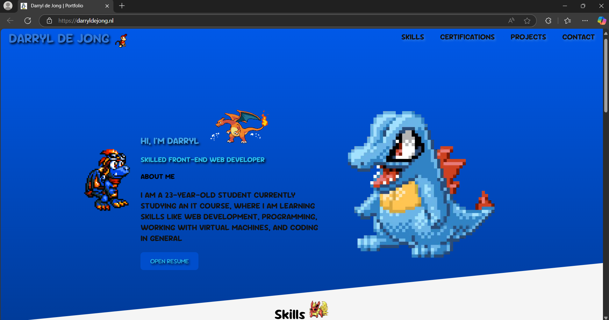

## Portfolio Darryl de Jong 🦤
### This website is built using HTML, CSS, and JavaScript, with a responsive design for both desktop and mobile devices to showcase my skills as an IT student.

#### For the website, I used:
- FontAwesome (fontawesome.com)
- SVGRepo (svgrepo.com)
- Particles.js (vincentgarreau.com/particles.js)
- Google Fonts (fonts.google.com)

A special thanks to these platforms for providing these resources.

#### Credits
- [FREE Bouncy Nidorina Icon](https://www.deviantart.com/kattling/art/FREE-Bouncy-Nidorina-Icon-784358759) by **kattling**
- [FREE Bouncy Croconaw Icon](https://www.deviantart.com/kattling/art/FREE-Bouncy-Croconaw-Icon-742374606)
- [FREE Bouncy Pikachu Icon](https://www.deviantart.com/kattling/art/FREE-Bouncy-Pikachu-Icon-335023977)
- [FREE Bouncy Rattata Icon](https://www.deviantart.com/kattling/art/FREE-Bouncy-Rattata-Icon-407236776)
- [{F2U} - Flareon Pixel Icon](https://www.deviantart.com/leokatana/art/F2U-Flareon-Pixel-Icon-670091180) by **LeoKatana**
- [{F2U} - Jolteon Icon](https://www.deviantart.com/leokatana/art/F2U-Jolteon-Icon-517955431)
- [{F2U} - Vaporeon Icon](https://www.deviantart.com/leokatana/art/F2U-Vaporeon-Icon-516169755)
- [{F2U} - Umbreon Pixel Icon](https://www.deviantart.com/leokatana/art/F2U-Umbreon-Pixel-Icon-671183499)
- [Sprigatito Jumping Animation](https://www.deviantart.com/nintendo95/art/Sprigatito-Jumping-Animation-938849622) by **Nintendo95**
- [Eevee Dance Animation](https://www.deviantart.com/nintendo95/art/Eevee-Dance-Animation-805679611)
- [Mega Pidgeot back Animated v2](https://www.deviantart.com/diegotoon20/art/Mega-Pidgeot-back-Animated-v2-Request-547672975) by **Diegotoon20**
- [Growlithe Sprite Gif](https://www.deviantart.com/sadslug/art/Growlithe-Sprite-Gif-267708461) by **sadslug**
- [Dragonite Stand](https://www.deviantart.com/hanshumon/art/Dragonite-Stand-153533650) by **Hanshumon**

Thank you to the artists for providing these sprites and for their generous permission to use them. 🐮

#### Disclaimer
The images used in this project are owned by their respective artists. All rights are reserved. If you're the owner of an image and wish to have it removed or modified, please contact me.
